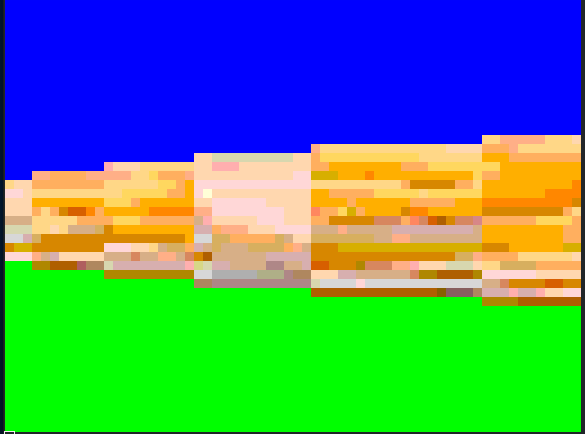

# DISPLAY YOUR FAVORITE GRAPHICS IN YOUR COMMAND LINE
> Using the power of duke!


```
./gradlew assemble
java -cp cli/build/libs/cli-1.0.jar:core/build/libs/core-1.0.jar net.karmacoder.duke.console.Main
```

will output this beautiful image


# Displaying a simple raycasting 3d env _WITH TEXTURES_

```
java -cp cli/build/libs/cli-1.0.jar:core/build/libs/core-1.0.jar net.karmacoder.duke.console.Main /usr/share/pixmaps/fedora-logo-sprite.png 3d $PWD/level --width 30 --height 30
```




Enjoy
